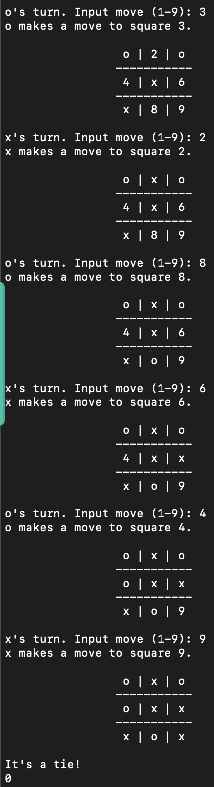

# TicTacToe
> Play a game of tic-tac-toe versus an AI based on the minimax algorithm.   
> Live demo [_here_](https://replit.com/@ChristopherChua/083-tictactoe?embed=1#main.py) (press play button to start).

## Table of Contents
* [General Info](#general-information)
* [Technologies Used](#technologies-used)
* [Features](#features)
* [Screenshots](#screenshots)
* [Setup](#setup)
* [Usage](#usage)
* [Project Status](#project-status)
* [To Do](#to-do)
* [Acknowledgements](#acknowledgements)
* [Contact](#contact)

## General Information
The purpose of this project is to:
- deepen my knowledge of Object Oriented Programming (OOP).
- create a simple AI based on the minimax algorithm.

## Technologies Used
- Python - version 3.9.1

## Features
- Can play as:
    - Human vs Human
    - Human vs RandomComputer
    - Human vs MinimaxComputer

## Screenshots

## Setup
There is no requirements.txt for this project. 

1. Download the [zipped files](https://github.com/chuawt/tictactoe/archive/refs/heads/main.zip) from the GitHub repository.
1. Unzip the files to a local directory.
1. Run the script mentioned in the below section.

## Usage
In Terminal, navigate to the local directory and use command:   
`$ python3 main.py` 

## Project Status
Project is: _completed_.  

## To Do
Some ways to extend this project:
- Create an AI using Reinforcement Learning.

## Acknowledgements
Many thanks to [100 Days of Code](https://www.udemy.com/course/100-days-of-code) for the idea of this project. 

## Contact
Created by [@chuawt](https://chuawt.github.io) - feel free to contact me!
