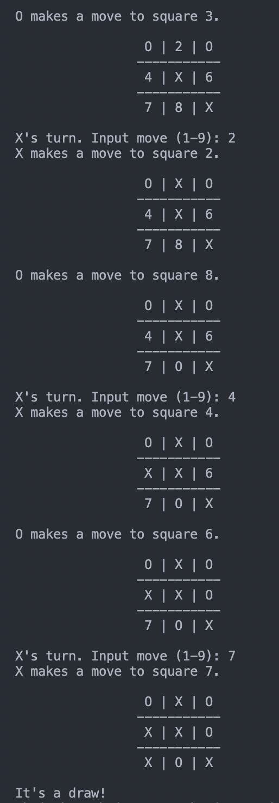

# TicTacToe
> Play a game of tic-tac-toe versus an AI based on the minimax algorithm.

## Table of Contents
* [General Info](#general-information)
* [Technologies Used](#technologies-used)
* [Features](#features)
* [Screenshots](#screenshots)
* [Setup](#setup)
* [Usage](#usage)
* [Project Status](#project-status)
* [To Do](#to-do)
* [Acknowledgements](#acknowledgements)
* [Contact](#contact)

## General Information
The purpose of this project is to:
- deepen my knowledge of Object Oriented Programming (OOP).
- create a simple AI based on the minimax algorithm.

## Technologies Used
- Python 3.9.1

## Features
- Can play as Human vs Human, Human vs Computer, or Computer vs Computer
- Print game can be toggled on or off.

## Screenshots

## Setup
What are the project requirements/dependencies? Where are they listed? A requirements.txt or a Pipfile.lock file perhaps? Where is it located?

Proceed to describe how to install / setup one's local environment / get started with the project.

## Usage
Change into this directory and type:

`python3 game.py`

## Project Status
Project is: _in progress_.  

## To Do
- README Setup
- Minimax AI

## Acknowledgements
Many thanks to [100 Days of Code](https://www.udemy.com/course/100-days-of-code) for the idea of this project. 

## Contact
Created by [@chuawt](https://chuawt.github.io) - feel free to contact me!
